# ADMET-Stack

### ADMET-Stack: A Multi-Representation Ensemble Framework for ADMET Prediction

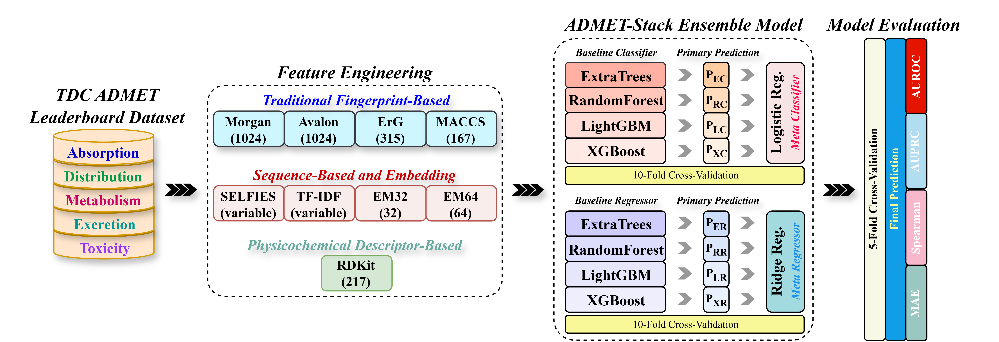

---

## Overview

ADMET-Stack is a controlled benchmark of **molecular representation**, not a new learning
algorithm. We hold a single stacked-ensemble architecture fixed and vary only the input
representation, evaluating **54 combinations** of structural fingerprints, physicochemical
descriptors and SELFIES-derived encodings across **all 22 endpoints** of the
[TDC ADMET Leaderboard](https://tdcommons.ai/benchmark/admet_group/overview/).

Because the architecture never changes, differences in performance are attributable to the
representation rather than to the model.

## Scientific motivation

Most ADMET papers introduce a new architecture *and* a new representation at the same time,
so the two contributions cannot be separated. Published benchmarks also frequently rely on
undisclosed splits, which makes cross-study numbers hard to interpret. This work fixes the
architecture and the splitting protocol (official TDC scaffold splits) and varies only the
representation, then asks a practical question: **how much representational complexity does
an ADMET endpoint actually need?**

## Main contributions

1. **A representation-controlled benchmark.** 54 representation configurations × 22 endpoints
   under one fixed stacked-ensemble architecture and the official TDC scaffold splits.
2. **A defensible default.** 217 RDKit physicochemical descriptors alone recover **94.3 %** of
   the best achievable performance on average (median **96.4 %**), outperforming 2,363 combined
   structural fingerprints (**93.2 %**) at roughly one eleventh of the feature count.
3. **A quantified complexity/benefit trade-off.** Adding six further representation classes
   lifts mean retention only to **96.2 %**, and the gain is concentrated on a small number of
   endpoints rather than spread evenly.
4. **Population-relative interpretation.** Predictions are converted to percentile ranks against
   **1,088** approved DrugBank compounds, so an output can be read as a position within the
   approved-drug landscape rather than as an isolated number.

---

## Datasets and endpoints

All 22 datasets are the official TDC ADMET Leaderboard benchmarks, retrieved through the
`PyTDC` API and used with the **official TDC scaffold-based train/validation/test splits**
(approximately 70 / 10 / 20). No custom splitting, filtering or resampling is applied.

| Category | Endpoint | Task | Metric | Size |
|---|---|---|---|---|
| Absorption | `Caco2_Wang` | Regression | MAE ↓ | 910 |
| | `HIA_Hou` | Binary | AUROC ↑ | 578 |
| | `Pgp_Broccatelli` | Binary | AUROC ↑ | 1,218 |
| | `Bioavailability_Ma` | Binary | AUROC ↑ | 640 |
| | `Lipophilicity_AstraZeneca` | Regression | MAE ↓ | 4,200 |
| | `Solubility_AqSolDB` | Regression | MAE ↓ | 9,982 |
| Distribution | `BBB_Martins` | Binary | AUROC ↑ | 2,030 |
| | `PPBR_AZ` | Regression | MAE ↓ | 1,614 |
| | `VDss_Lombardo` | Regression | Spearman ↑ | 1,130 |
| Metabolism | `CYP3A4_Substrate_CarbonMangels` | Binary | AUROC ↑ | 670 |
| | `CYP2D6_Substrate_CarbonMangels` | Binary | AUPRC ↑ | 667 |
| | `CYP2C9_Substrate_CarbonMangels` | Binary | AUPRC ↑ | 669 |
| | `CYP3A4_Veith` | Binary | AUPRC ↑ | 12,328 |
| | `CYP2D6_Veith` | Binary | AUPRC ↑ | 13,130 |
| | `CYP2C9_Veith` | Binary | AUPRC ↑ | 12,092 |
| Excretion | `Half_Life_Obach` | Regression | Spearman ↑ | 667 |
| | `Clearance_Hepatocyte_AZ` | Regression | Spearman ↑ | 1,213 |
| | `Clearance_Microsome_AZ` | Regression | Spearman ↑ | 1,102 |
| Toxicity | `LD50_Zhu` | Regression | MAE ↓ | 7,385 |
| | `hERG` | Binary | AUROC ↑ | 655 |
| | `AMES` | Binary | AUROC ↑ | 7,278 |
| | `DILI` | Binary | AUROC ↑ | 475 |

**13 classification** and **9 regression** endpoints. ↑ higher is better, ↓ lower is better.
Each endpoint is scored with its own official TDC metric; direction is respected everywhere in
the ranking and comparison code.

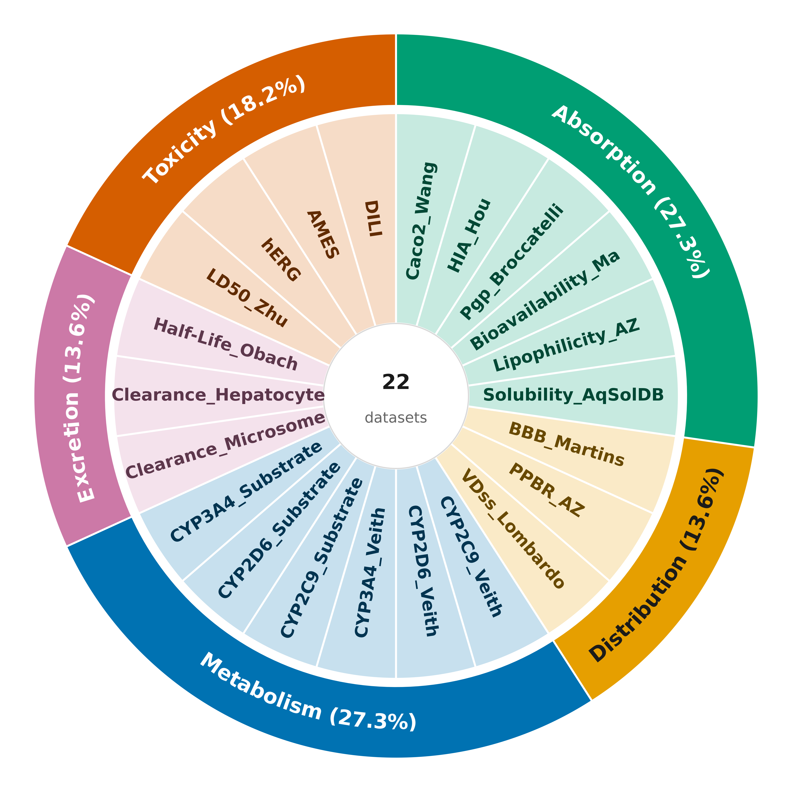

---

## Molecular representations

Eight extraction methods, represented as nine feature blocks. All are implemented in
`FeatureExtractor` in [`notebooks/ADMET_Feature_Extractor.ipynb`](notebooks/ADMET_Feature_Extractor.ipynb).

| Abbr. | Type | Method | RDKit / library call | Dim. |
|---|---|---|---|---|
| `M` | Fingerprint | Morgan (ECFP, r = 2) | `rdFingerprintGenerator.GetMorganGenerator` | 1024 |
| `A` | Fingerprint | Avalon | `pyAvalonTools.GetAvalonFP` | 1024 |
| `E` | Fingerprint | Extended Reduced Graph | `GetErGFingerprint`, zero-padded/truncated | 315 |
| `MC` | Fingerprint | MACCS keys | `MACCSkeys.GenMACCSKeys` | 167 |
| `R` | Descriptor | RDKit physicochemical | `Descriptors._descList` | **217** |
| `S` | Sequence | Tokenised SELFIES (integer index) | `selfies.split_selfies` | variable ᵃ |
| `TI` | Sequence | SELFIES TF–IDF | `TfidfVectorizer(token_pattern=r"\[.*?\]")` | variable ᵇ |
| `EM32` | Embedding | SELFIES neural embedding | embedding → mean-pool → linear | 32 |
| `EM64` | Embedding | SELFIES neural embedding | embedding → mean-pool → linear | 64 |

ᵃ Padded/truncated to the 99th percentile of SELFIES token-sequence length for that endpoint.
ᵇ Capped by the same 99th-percentile value.

Useful totals (all verified against the code): `M+A+E` = **2,363** · `M+A+E+R` = **2,580** ·
`M+A+E+R+MC` = **2,747**.

> **The 217 descriptor count is RDKit-version dependent.** `len(Descriptors._descList)` returns
> 217 from RDKit 2024.03 onward and 210 in earlier releases. The pinned environment fixes this;
> do not change the RDKit pin without re-checking.

Descriptors that raise an exception or return a non-finite value are replaced with `0.0`.

### The 54 configurations

```
48 core configurations   =  {M, A, E} backbone (always present)
                            × {S}    present / absent
                            × {R}    present / absent      → 2^4 = 16
                            × {MC}   present / absent
                            × {TI}   present / absent
                            × {none, EM32, EM64}           → × 3   = 48

 6 single-block baselines =  R, MC, S, TI, EM32, EM64

54 total
```

This is a complete factorial design over the shared `M_A_E` backbone, so every configuration
containing a given block has an exact counterpart differing only in that block. That is what
makes the matched-pair marginal-contribution analysis possible. The design was verified to be
exactly complete — no missing and no extra configurations — across all 22 result tables.

---

## Model architecture

The same stacked ensemble is used for every endpoint and every representation configuration.
Only the input matrix changes.

| | Classification | Regression |
|---|---|---|
| Base learners | `ExtraTreesClassifier`, `RandomForestClassifier`, `LGBMClassifier`, `XGBClassifier` | `ExtraTreesRegressor`, `RandomForestRegressor`, `LGBMRegressor`, `XGBRegressor` |
| Meta-learner | `LogisticRegression` (`solver='liblinear'`) | `Ridge` |
| Stacking | `StackingClassifier(cv=10)` | `StackingRegressor(cv=10)` |
| Repeats | seeds 1–5 | seeds 1–5 |
| Reported | mean ± SD over the 5 runs | mean ± SD over the 5 runs |

**Out-of-fold construction.** Meta-learner inputs are the out-of-fold predictions produced by
scikit-learn's `Stacking*` estimators using 10-fold cross-validation on the training data. The
base learners are then refit on the full training data for prediction.

**Split usage.** The base learners are fitted on the **combined training and validation
partitions**; the official TDC test set is held out entirely and is never seen during fitting,
tuning or model selection.

**Preprocessing.** Mean imputation followed by `StandardScaler`. In the released processed
data the scaler is fitted on the **training split only** and applied unchanged to validation and
test — verified directly: training columns have mean 0.0000 / SD 1.0001, while validation and
test columns deviate from that (max |mean| 0.28 and 0.31 respectively). No class-imbalance
handling and no probability calibration are applied.

---

## Verified results

All figures below are reproduced from the released data and archives in this repository, or
from the Supplementary Information. Numbers are stated only where they were independently
recomputed.

### Representation ranking

Configurations are compared by min–max normalising each endpoint's deviation from its ideal
value and summing across the 22 endpoints (lower is better).

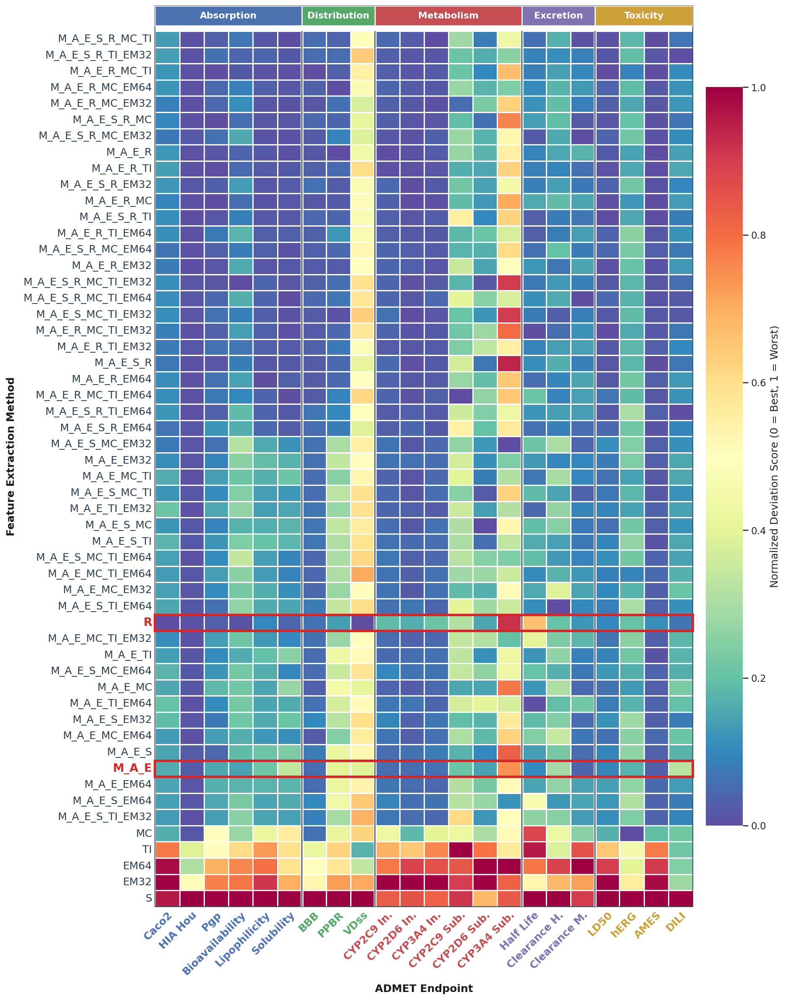

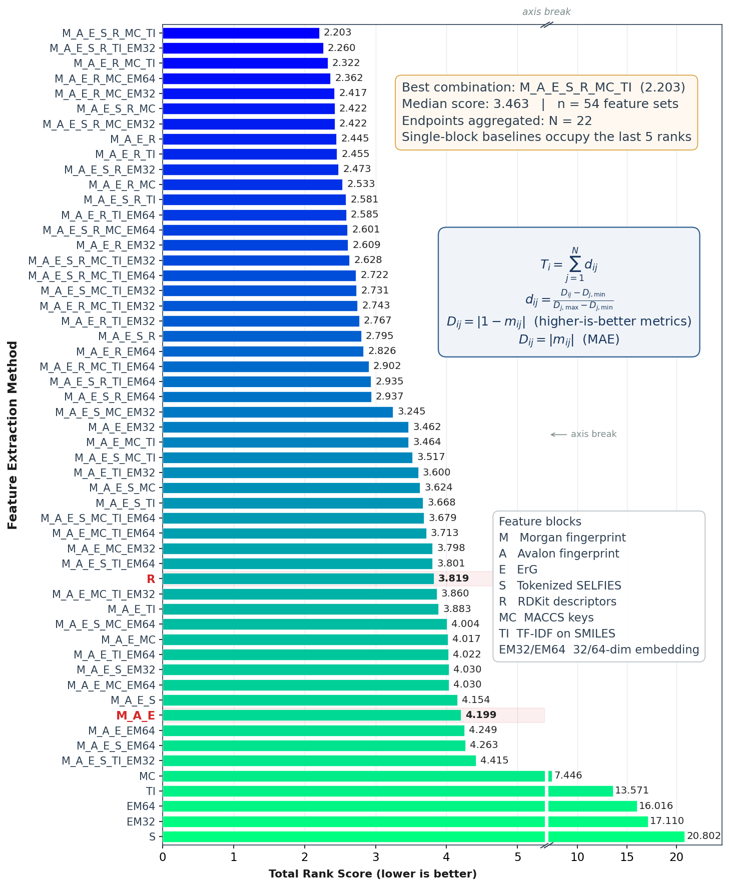

| Configuration | Total rank score |
|---|---|
| `M_A_E_S_R_MC_TI` (best overall) | **2.203** |
| `R` (RDKit descriptors only) | 3.819 |
| `M_A_E` (fingerprints only) | 4.199 |
| median of all 54 | 3.463 |

### Performance–complexity trade-off

Retention = performance relative to the best of all 54 configurations for that endpoint,
averaged over the 22 endpoints with metric direction accounted for.

| Configuration | Representations | Dim. | Mean | Median | ≥ 95 % | Best |
|---|---|---|---|---|---|---|
| `R` | RDKit descriptors only | 217 | 94.3 % | 96.4 % | 13/22 | 2/22 |
| `M_A_E` | Morgan + Avalon + ErG | 2,363 | 93.2 % | 95.4 % | 11/22 | 0/22 |
| `M_A_E_R` | fingerprints + RDKit | 2,580 | 95.8 % | 98.9 % | 15/22 | 2/22 |
| `M_A_E_S_R_MC_TI` | best overall | ≥ 2,747 | 96.2 % | 98.6 % | 18/22 | 2/22 |

Descriptors alone are already within 1.9 percentage points of the best configuration on
average, at roughly one thirteenth of the fixed-length dimensionality.

### Marginal contribution of each feature block

Matched-pair differences over the 48 core configurations, two-sided Wilcoxon signed-rank test
with Holm correction across the six blocks.

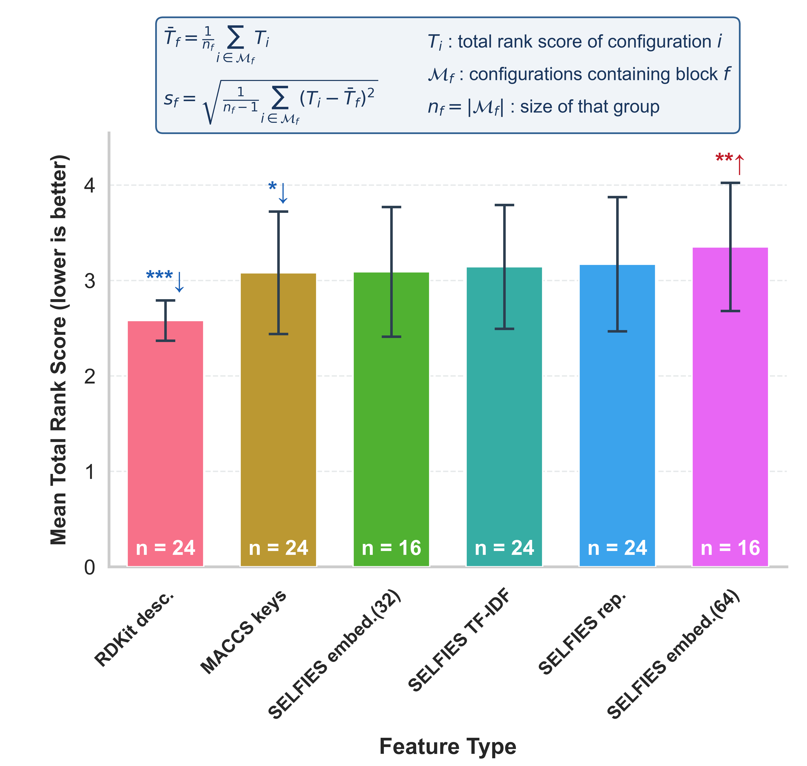

| Block | n | Mean total rank score | Δ vs matched counterpart | Holm-adj. *p* | |
|---|---|---|---|---|---|
| RDKit descriptors | 24 | 2.581 ± 0.212 | **−1.229** | < 0.001 | improves |
| MACCS keys | 24 | 3.082 ± 0.642 | −0.227 | 0.038 | improves |
| SELFIES embedding (32) | 16 | 3.091 ± 0.679 | −0.051 | 0.912 | n.s. |
| SELFIES TF–IDF | 24 | 3.144 ± 0.649 | −0.103 | 0.285 | n.s. |
| Tokenised SELFIES | 24 | 3.171 ± 0.703 | −0.048 | 0.912 | n.s. |
| SELFIES embedding (64) | 16 | 3.352 ± 0.671 | **+0.209** | 0.005 | worsens |

RDKit descriptors dominate; MACCS adds a smaller but significant benefit; the SELFIES blocks
are not significant, and the 64-dimensional embedding is significantly harmful.

### Where the extra representations actually help

RDKit-only retention is highly endpoint dependent:

- **Large gap** — `Half_Life_Obach` 59.7 %, `CYP2C9_Substrate` 85.9 %, `Clearance_Hepatocyte_AZ` 90.5 %.
  For `Half_Life_Obach`, Spearman rises from **0.331** (RDKit only) to **0.554** (best
  configuration), a ~67 % relative improvement.
- **Essentially no gap (≥ 98.7 %)** — `Caco2_Wang`, `VDss_Lombardo`, `HIA_Hou`,
  `Pgp_Broccatelli`, `Bioavailability_Ma`, `BBB_Martins`, `AMES`, `DILI`. For `Caco2_Wang` and
  `VDss_Lombardo` the descriptor-only model is the best of all 54.

### Benchmark performance

ADMET-Stack ranked **first on 8 of 22 endpoints and within the top three on 14**, against the
public TDC ADMET Leaderboard.

| Category | Endpoint | Metric | ADMET-Stack | Best configuration | Leaderboard rank |
|---|---|---|---|---|---|
| Absorption | `Caco2_Wang` | MAE ↓ | 0.302 ± 0.002 | `R` | 9/24 |
| | `HIA_Hou` | AUROC ↑ | 0.996 ± 0.001 | `M_A_E_R_EM32` | **1/20** |
| | `Pgp_Broccatelli` | AUROC ↑ | 0.942 ± 0.001 | `M_A_E_R_MC` | **1/16** |
| | `Bioavailability_Ma` | AUROC ↑ | 0.752 ± 0.011 | `M_A_E_S_R_MC_TI_EM32` | not ranked |
| | `Lipophilicity_AstraZeneca` | MAE ↓ | 0.440 ± 0.001 | `M_A_E_R_EM64` | **1/21** |
| | `Solubility_AqSolDB` | MAE ↓ | 0.609 ± 0.001 | `M_A_E_S_R_MC_TI_EM64` | **1/18** |
| Distribution | `BBB_Martins` | AUROC ↑ | 0.912 ± 0.003 | `M_A_E_R_MC_TI` | 6/26 |
| | `PPBR_AZ` | MAE ↓ | 6.966 ± 0.011 | `M_A_E_R_MC_EM64` | **1/20** |
| | `VDss_Lombardo` | Spearman ↑ | 0.643 ± 0.020 | `R` | 3/19 |
| Metabolism | `CYP3A4_Substrate` | AUROC ↑ | 0.667 ± 0.006 | `M_A_E_S_MC_EM32` | 2/19 |
| | `CYP2D6_Substrate` | AUPRC ↑ | 0.615 ± 0.010 | `M_A_E_S_MC` | 14/18 |
| | `CYP2C9_Substrate` | AUPRC ↑ | 0.434 ± 0.026 | `M_A_E_R_MC_TI_EM64` | 5/20 |
| | `CYP3A4_Veith` | AUPRC ↑ | 0.875 ± 0.001 | `M_A_E_S_R_MC_TI` | 9/19 |
| | `CYP2D6_Veith` | AUPRC ↑ | 0.730 ± 0.001 | `M_A_E_R_MC` | 3/19 |
| | `CYP2C9_Veith` | AUPRC ↑ | 0.842 ± 0.001 | `M_A_E_R` | 2/20 |
| Excretion | `Half_Life_Obach` | Spearman ↑ | 0.554 ± 0.008 | `M_A_E_R_MC_TI_EM32` | 5/20 |
| | `Clearance_Hepatocyte_AZ` | Spearman ↑ | 0.536 ± 0.004 | `M_A_E_S_TI_EM64` | 2/18 |
| | `Clearance_Microsome_AZ` | Spearman ↑ | 0.652 ± 0.004 | `M_A_E_S_R_MC_EM32` | **1/20** |
| Toxicity | `LD50_Zhu` | MAE ↓ | 0.388 ± 0.000 | `M_A_E_R_MC_TI` | **1/22** |
| | `hERG` | AUROC ↑ | 0.854 ± 0.002 | `MC` | 6/20 |
| | `AMES` | AUROC ↑ | 0.936 ± 0.001 | `M_A_E_R` | **1/20** |
| | `DILI` | AUROC ↑ | 0.934 ± 0.002 | `M_A_E_S_R_TI_EM32` | 2/20 |

Ranks are computed against the public leaderboard as `1 + (entries strictly better) + (entries
tied)`. `Bioavailability_Ma` scores below every listed entry and is therefore not assigned a rank.

ADMET-Stack was compared against ADMET-AI, ADMETrix, MiniMol, and MapLight+GNN:


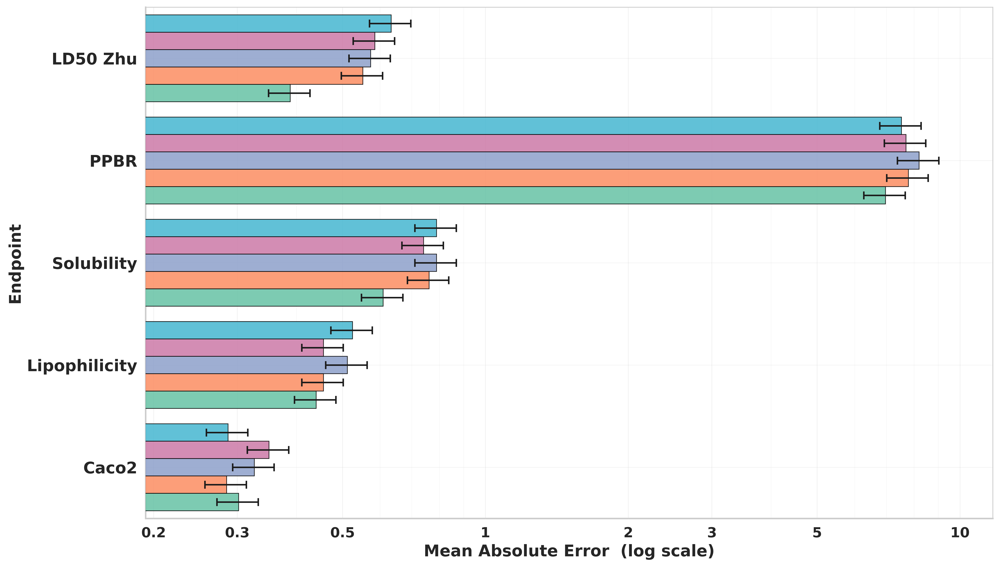
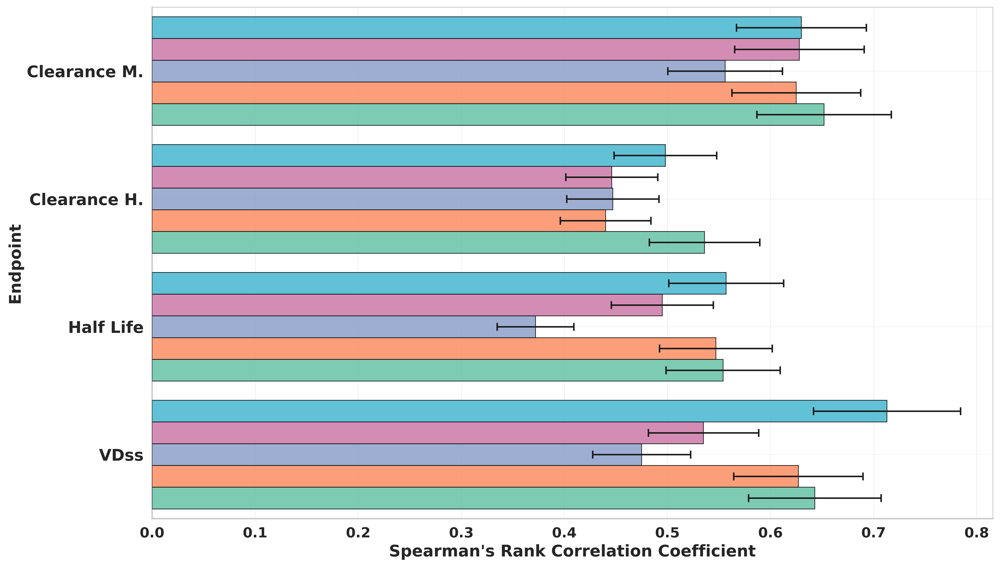
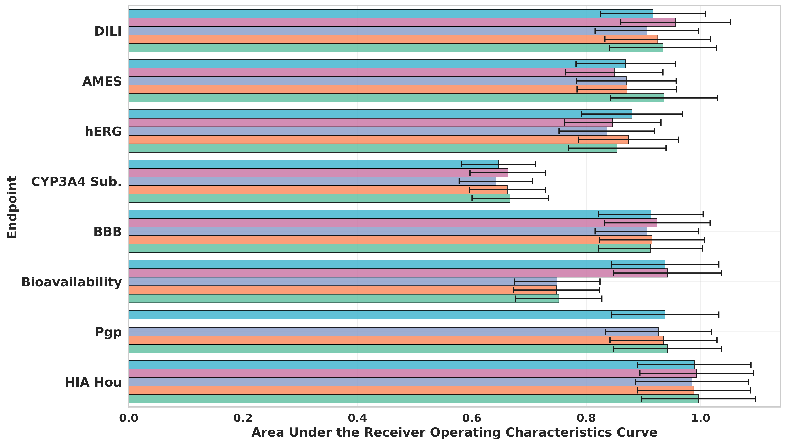
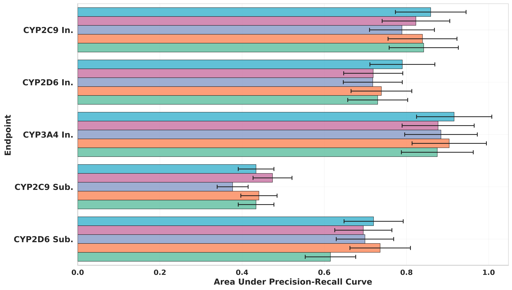

### Comparison against four leaderboard baselines

ADMET-AI, ADMETrix, MiniMol and MapLight+GNN. Across **87 available pairwise comparisons**
(22 endpoints × 4 baselines, minus `Pgp_Broccatelli` for MiniMol, which has no leaderboard
entry), ADMET-Stack scored better in **61 cases (70.1 %)**, tied once and was lower in 25.

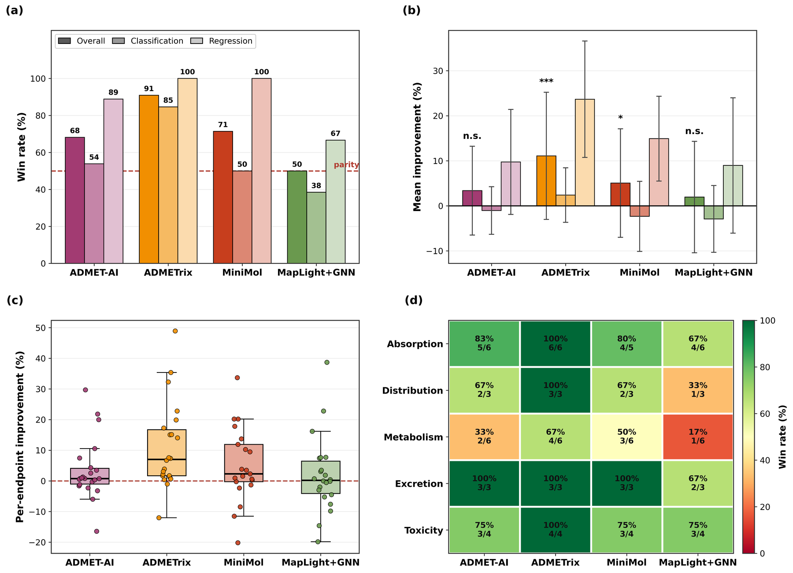

| Baseline | Win rate | Classification Δ | *p* | Regression Δ | *p* |
|---|---|---|---|---|---|
| ADMET-AI | 15/22 (68.2 %) | −1.0 ± 5.3 % | 0.685 | +9.8 ± 11.7 % | **0.039** |
| ADMETrix | 20/22 (90.9 %) | +2.4 ± 6.1 % | **0.033** | +23.7 ± 12.9 % | **0.004** |
| MiniMol | 15/21 (71.4 %) | −2.3 ± 7.8 % | 0.677 | +14.9 ± 9.4 % | **0.004** |
| MapLight+GNN | 11/22 (50.0 %) | −2.9 ± 7.4 % | 0.339 | +9.0 ± 15.0 % | 0.164 |

Two-sided one-sample Wilcoxon signed-rank tests of per-endpoint improvements against zero.
The advantage is concentrated in **regression**; classification is statistically
indistinguishable from the strongest baselines. **CYP450 endpoints are the weakest category**
for ADMET-Stack — better or equal in only 11 of 24 comparisons (46 %), versus 83 %
(absorption), 92 % (excretion) and 81 % (toxicity).

### External validation

Endpoint-specific models were evaluated on 13 external datasets (14 evaluation sets) from an
in-house collection, PharmaBench, AutoML and Admetica. Selected results:

| Property | n | ACC | AUROC | AUPRC | Source |
|---|---|---|---|---|---|
| AMES | 25,536 | 0.836 | 0.917 | 0.786 | in-house |
| BBB | 654 | 0.660 | 0.741 | 0.763 | PharmaBench |
| BBB (test subset) | 66 | 0.833 | 0.920 | 0.958 | AutoML |
| BBB (full) | 323 | 0.851 | 0.921 | 0.962 | AutoML |
| CYP2C9 inhibition | 387 | 0.429 | 0.949 | 0.984 | AutoML |
| CYP2D6 inhibition | 988 | 0.713 | 0.793 | 0.674 | AutoML |
| CYP3A4 inhibition | 1,186 | 0.709 | 0.795 | 0.707 | AutoML |
| P-gp substrate | 528 | 0.590 | 0.664 | 0.706 | AutoML |
| hERG | 20,982 | 0.763 | 0.634 | 0.917 | Admetica |

Transfer is strongly endpoint dependent. The complete results across **all** external datasets,
including several on which the models perform poorly, are in Supplementary Table S32 — please
read that table rather than this selection when judging external generalisation. The external
datasets and evaluation code are **not** in this repository (see *Limitations*).

### Approved-drug percentile context

Predictions are converted to percentile ranks against a curated reference population of
**1,088** approved DrugBank compounds (derived from 2,579 ADMET-AI DrugBank predictions by
standardisation, deduplication and removal of compounds overlapping the TDC benchmarks).

For a query prediction on an endpoint,
`percentile = 100 × (number of reference drugs with a lower prediction) / 1088`.

For the six endpoints with a defined adverse direction — AMES, DILI, hERG, and CYP2C9/2D6/3A4
**inhibition** — percentiles are transformed as `100 − percentile` so that higher always means
more favourable, and the six are averaged into an aggregate **risk-favorability score**. CYP
**substrate** endpoints are excluded, because metabolic-pathway involvement has no universally
favourable direction.


A 20-drug case-study panel follows the four Bickerton *et al.* drug-likeness groups. Three
representative profiles:

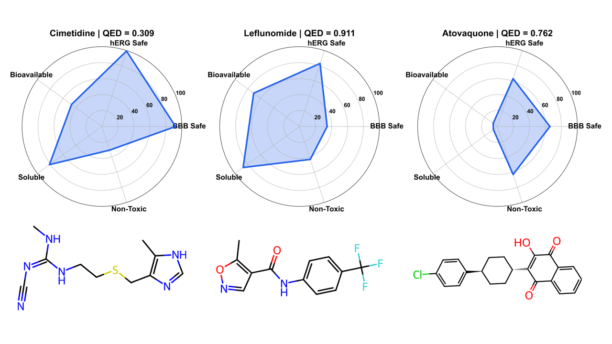

Across the full 1,088-compound reference population the aggregate risk-favorability score shows
**no meaningful linear association with QED** (Pearson *r* = −0.042, *p* = 0.162, bootstrap 95 %
CI including zero), suggesting that percentile-based ADMET profiles carry information that
general drug-likeness does not.

> The reference predictions in `Case Study/DrugBank_reference_ADMET_clipped.csv` have half-life
> clipped at a lower bound of 0 and PPBR clipped at an upper bound of 100. Percentiles derive
> from these clipped values.

---

## Repository structure

```
TDC-ADMET/
├── notebooks/                     # feature extraction and model training
│   ├── ADMET_Feature_Extractor.ipynb
│   ├── ADMET_classification_stacking_pipeline.ipynb
│   └── ADMET_regression_stacking_pipeline.ipynb
├── data/
│   ├── raw/                       # official TDC scaffold splits, 22 × .rar
│   └── processed/                 # imputed + scaled feature matrices, 22 × .rar
├── models/                        # trained stacked ensembles, 5 seeds per endpoint (.rar)
├── results/
│   ├── *_Outputs.rar              # per-seed test-set predictions
│   ├── results/*_results.rar      # per-seed metrics and run summaries
│   └── Model_Performance_*.csv    # best configuration per endpoint
├── Case Study/                    # DrugBank reference set, percentiles, QED analysis
├── figures/                # web-sized figures used in this README
├── figures/                       # full-resolution architecture diagram
├── environment.yml
├── requirements.txt
└── README.md
```

Large artefacts are stored as `.rar` archives; the repository is about 1.6 GB when cloned.
Multi-part archives (`models/*/....part01.rar`, `part02.rar`, …) must be extracted from
**part 1**, with all parts in the same directory.

---

## Installation

Requires Python 3.10 and a tool that can extract `.rar` archives
([WinRAR](https://www.rarlab.com/), [7-Zip](https://www.7-zip.org/) with the RAR plugin, or
`unrar`).

```bash
git clone https://github.com/college-of-pharmacy-gachon-university/TDC-ADMET.git
cd TDC-ADMET
```

**Conda (recommended):**

```bash
conda env create -f environment.yml
conda activate admet-stack
jupyter lab
```

**pip:**

```bash
python -m venv .venv
source .venv/bin/activate      # Windows: .venv\Scripts\activate
pip install -r requirements.txt
jupyter lab
```

Verify the descriptor count matches the paper:

```bash
python -c "from rdkit.Chem import Descriptors; print(len(Descriptors._descList))"   # -> 217
```

### Hardware and GPU notes

Everything in this repository runs on CPU, and the pinned environment installs CPU builds.

The training notebooks as published request GPU devices. If you do not have a compatible GPU,
change these two lines before running:

- `notebooks/ADMET_classification_stacking_pipeline.ipynb`
  `XGBClassifier(tree_method='hist', device='cuda', ...)` → `device='cpu'`
- `notebooks/ADMET_regression_stacking_pipeline.ipynb`
  `LGBMRegressor(device_type='gpu', gpu_platform_id=0, gpu_device_id=0, ...)` →
  `LGBMRegressor(device='cpu', ...)` (the CPU variant is present in the notebook, commented out)
  and `XGBRegressor(..., device='cuda')` → `device='cpu'`

Training one endpoint × one configuration × 5 seeds takes minutes to a few hours depending on
dataset size. The **full study is 22 endpoints × 54 configurations × 5 seeds**, each a
stacked ensemble of four learners with 10-fold internal cross-validation — on the order of
10⁶ model fits. It is not reproducible in a single session on ordinary hardware. Start from the
released predictions and archives instead.

---
